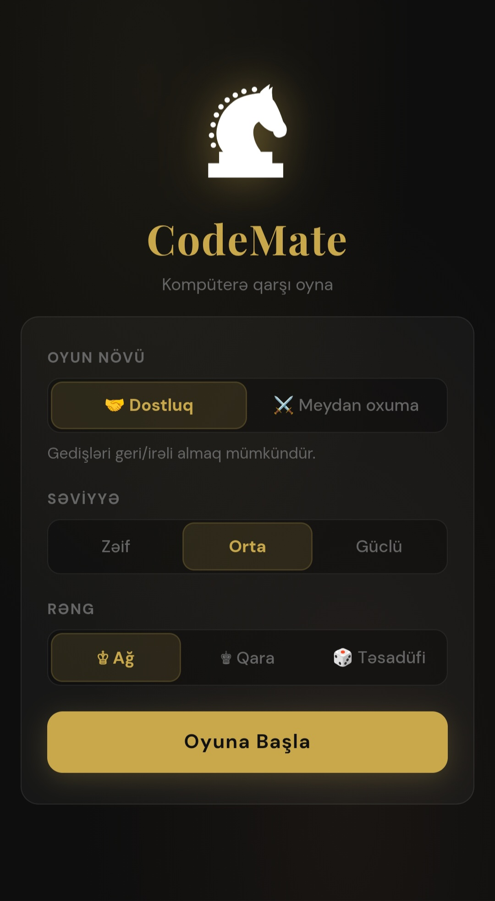
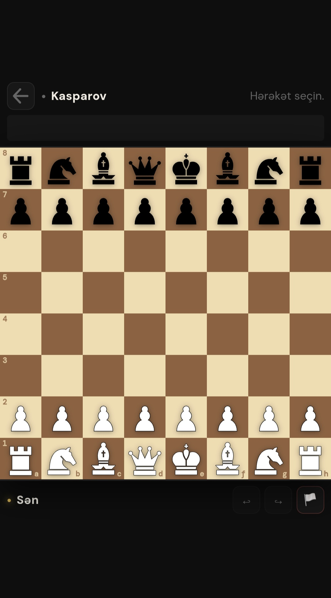
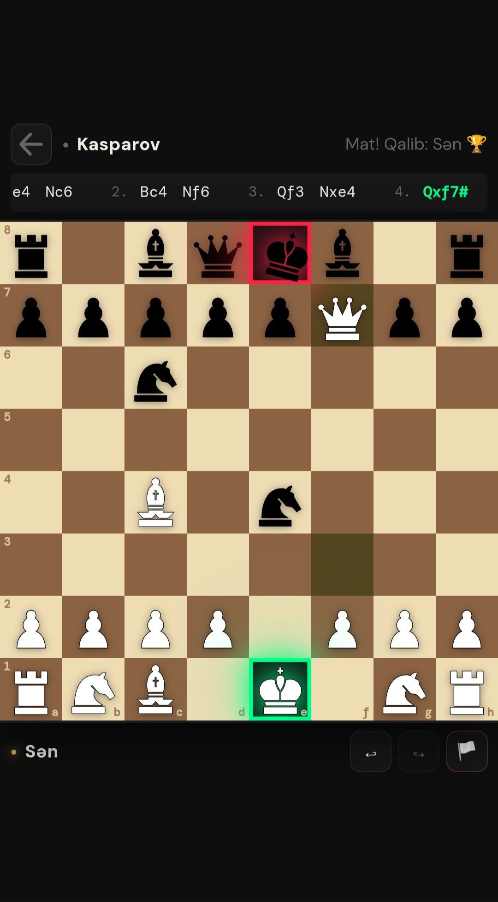

# Şahmat Oyunu

Bu proyekt, brauzerdə oynanıla bilən bir şahmat oyunudur. Ağ və qara fiqurlar sırayla oynayır, məqsəd rəqib şahı mat etməkdir.

## Fayllar

- `index.html` - Şahmat taxtasının interfeysi
- `style.css` - İnterfeys dizaynı
- `script.js` - Fiqurlar və gedişlər
- `bot.js` - Oyun məntiqi

## Əlavələr

- Castle və enpassant özəllikləri
- Süni intellekt dəstəkli kompüterə qarşı oyun
- Move history və gedişi geri/irəli alma funksiyası

## Ana Səhifə

## Oyun

## Mat

